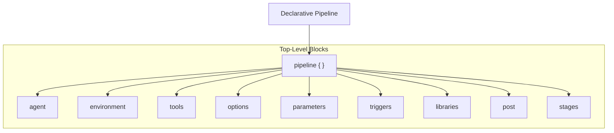
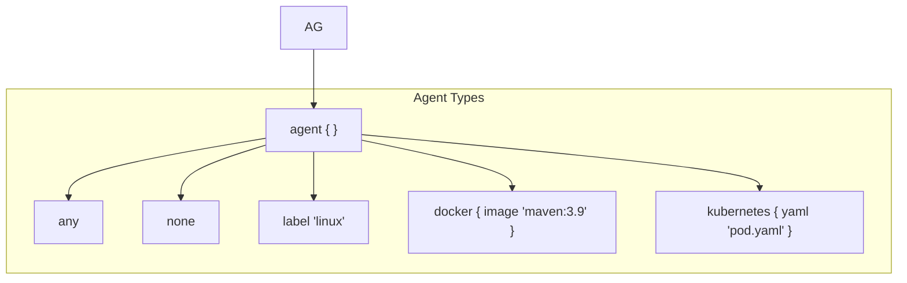
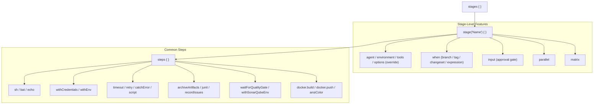
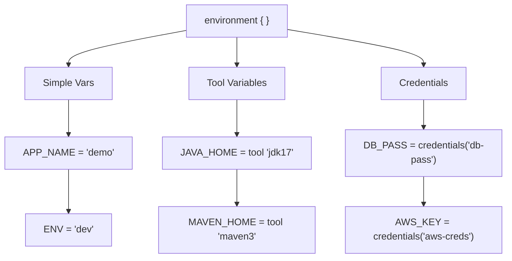
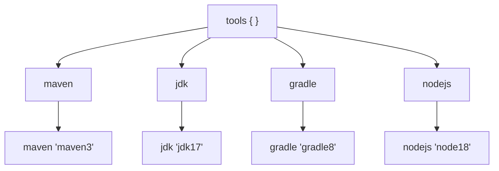
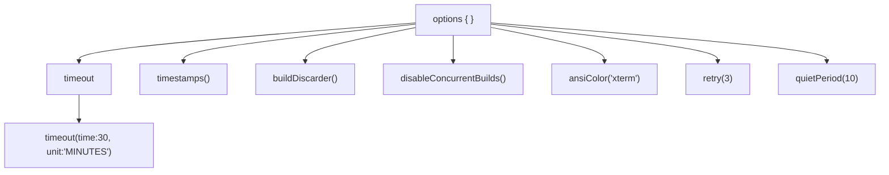
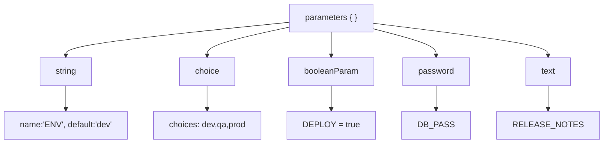
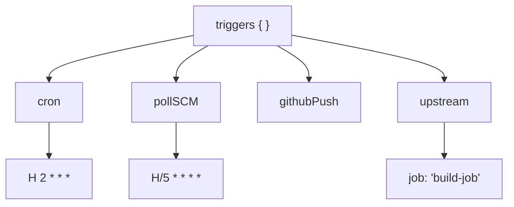
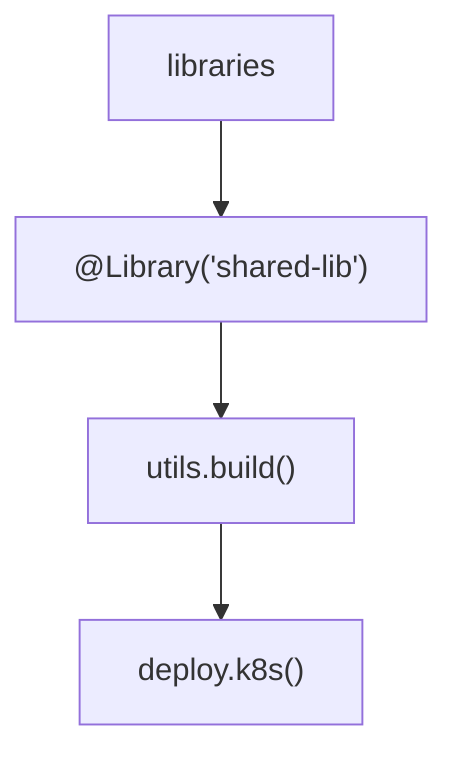
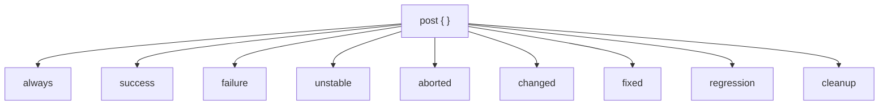

**Declarative Pipeline - Top-Level Blocks**

```mermaid
flowchart TB
    A["Declarative Pipeline"] --> B["pipeline { }"]

    subgraph "Top-Level Blocks"
        direction TB
        B --> AG["agent"]
        B --> EN["environment"]
        B --> TO["tools"]
        B --> OP["options"]
        B --> PA["parameters"]
        B --> TR["triggers"]
        B --> LI["libraries"]
        B --> PO["post"]
        B --> ST["stages"]
    end
```

**Agent**

```mermaid
flowchart TD
    AG --> AG1["agent { }"]

    subgraph "Agent Types"
        direction TB
        AG1 --> AG_ANY["any"]
        AG1 --> AG_NONE["none"]
        AG1 --> AG_LABEL["label 'linux'"]
        AG1 --> AG_DOCKER["docker { image 'maven:3.9' }"]
        AG1 --> AG_K8S["kubernetes { yaml 'pod.yaml' }"]
    end
```

**Stages**

```mermaid
flowchart TB
    ST["stages { }"] --> S1["stage('Name') { }"]

    subgraph "Stage-Level Features"
        direction TB
        S1 --> SA["agent / environment / tools / options (override)"]
        S1 --> WH["when (branch / tag / changeset / expression)"]
        S1 --> IN["input (approval gate)"]
        S1 --> PR["parallel"]
        S1 --> MX["matrix"]
    end

    S1 --> STP["steps { }"]

    subgraph "Common Steps"
        direction TB
        STP --> C1["sh / bat / echo"]
        STP --> C2["withCredentials / withEnv"]
        STP --> C3["timeout / retry / catchError / script"]
        STP --> C4["archiveArtifacts / junit / recordIssues"]
        STP --> C5["waitForQualityGate / withSonarQubeEnv"]
        STP --> C6["docker.build / docker.push / ansiColor"]
    end
```
**Environment**

```mermaid
flowchart TB
    EN["environment { }"]
    EN --> E1["Simple Vars"]
    E1 --> E11["APP_NAME = 'demo'"]
    E11 --> E12["ENV = 'dev'"]

    EN --> E2["Tool Variables"]
    E2 --> E21["JAVA_HOME = tool 'jdk17'"]
    E21 --> E22["MAVEN_HOME = tool 'maven3'"]

    EN --> E3["Credentials"]
    E3 --> E31["DB_PASS = credentials('db-pass')"]
    E31 --> E32["AWS_KEY = credentials('aws-creds')"]
```

**Tools**

```mermaid
flowchart TB
    TO["tools { }"]
    TO --> T1["maven"]
    T1 --> T11["maven 'maven3'"]

    TO --> T2["jdk"]
    T2 --> T21["jdk 'jdk17'"]

    TO --> T3["gradle"]
    T3 --> T31["gradle 'gradle8'"]

    TO --> T4["nodejs"]
    T4 --> T41["nodejs 'node18'"]
```

**Options**

```mermaid
flowchart TB
    OP["options { }"]
    OP --> O1["timeout"]
    O1 --> O11["timeout(time:30, unit:'MINUTES')"]

    OP --> O2["timestamps()"]
    OP --> O3["buildDiscarder()"]
    OP --> O4["disableConcurrentBuilds()"]
    OP --> O5["ansiColor('xterm')"]
    OP --> O6["retry(3)"]
    OP --> O7["quietPeriod(10)"]
```

**Parameters**

```mermaid
flowchart TB
    PA["parameters { }"]
    PA --> P1["string"]
    P1 --> P11["name:'ENV', default:'dev'"]

    PA --> P2["choice"]
    P2 --> P21["choices: dev,qa,prod"]

    PA --> P3["booleanParam"]
    P3 --> P31["DEPLOY = true"]

    PA --> P4["password"]
    P4 --> P41["DB_PASS"]

    PA --> P5["text"]
    P5 --> P51["RELEASE_NOTES"]
```

**Triggers**

```mermaid
flowchart TB
    TR["triggers { }"]
    TR --> T1["cron"]
    T1 --> T11["H 2 * * *"]

    TR --> T2["pollSCM"]
    T2 --> T21["H/5 * * * *"]

    TR --> T3["githubPush"]
    TR --> T4["upstream"]
    T4 --> T41["job: 'build-job'"]
```

**Libraries**

```mermaid
flowchart TB
    LI["libraries"]
    LI --> L1["@Library('shared-lib')"]
    L1 --> L11["utils.build()"]
    L11 --> L12["deploy.k8s()"]
```

**Post**

```mermaid
flowchart TB
    PO["post { }"]
    PO --> P1["always"]
    PO --> P2["success"]
    PO --> P3["failure"]
    PO --> P4["unstable"]
    PO --> P5["aborted"]
    PO --> P6["changed"]
    PO --> P7["fixed"]
    PO --> P8["regression"]
    PO --> P9["cleanup"]
```
