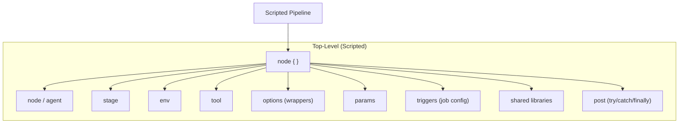
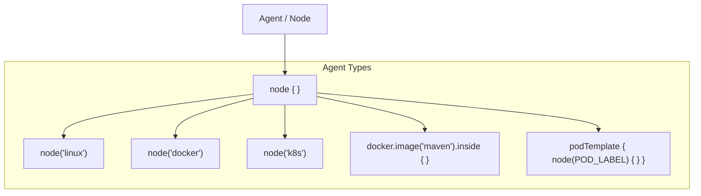
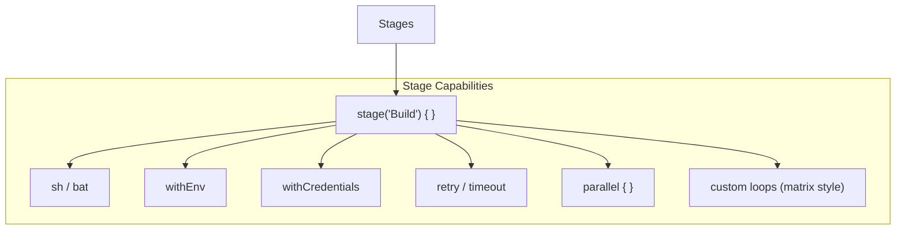
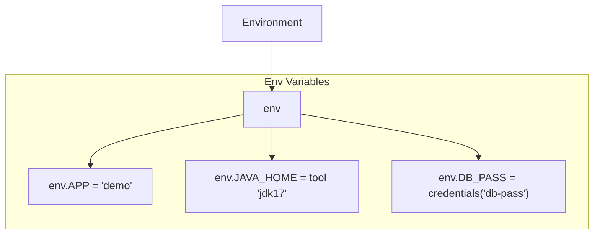
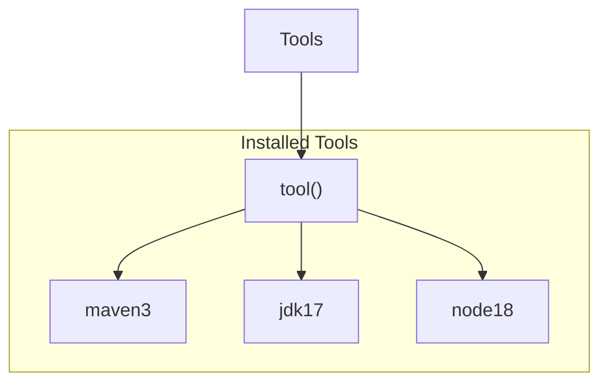
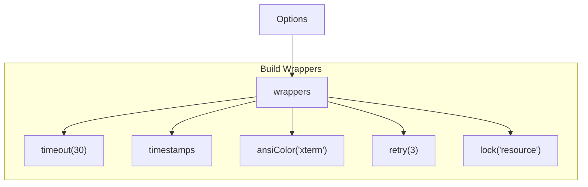
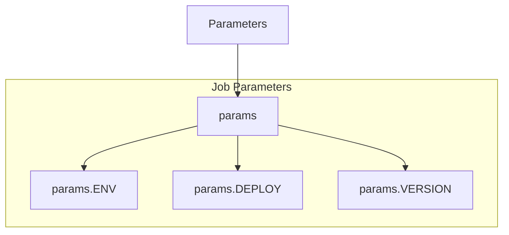
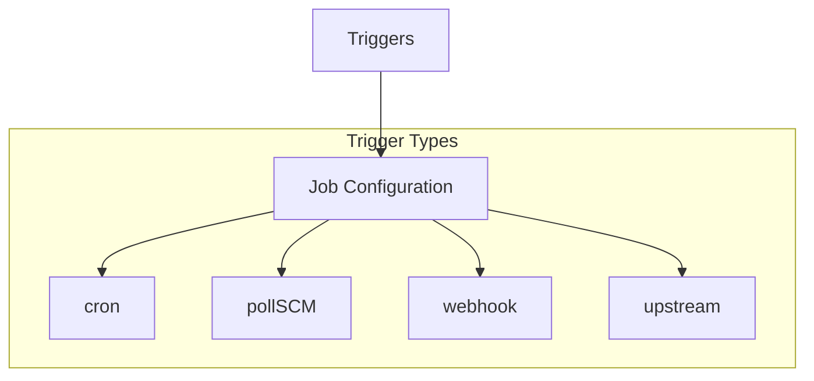
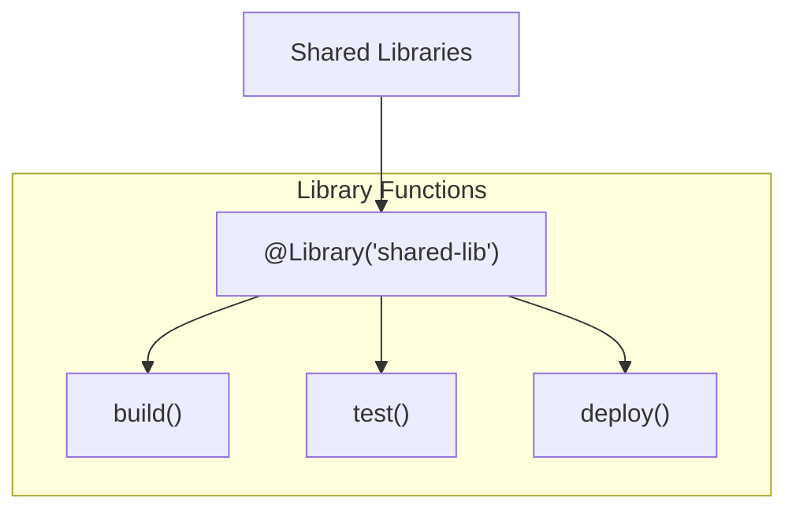
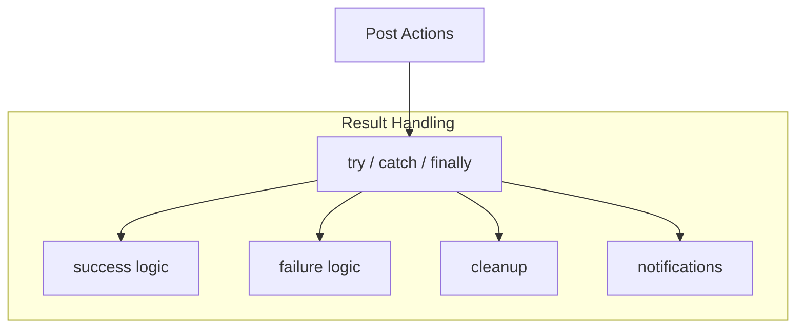

**Scripted Pipeline – Top-Level Blocks**

**Agent / Node**

**Stages**

**Environment**

**Tools**

**Options / Wrappers**

**Parameters

**Triggers**

**Shared Libraries**

**Post / Error Handling**

